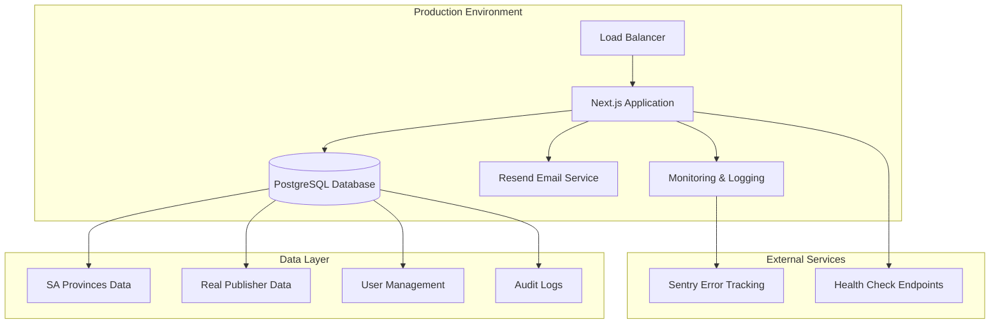

# Beta Production Readiness Design Document

## Overview

This design document outlines the systematic approach to prepare Tender Hub for beta testing in a production environment. Based on the comprehensive technical audits, the system demonstrates strong foundational architecture but requires specific enhancements across four key areas: build quality, data integrity, API completeness, and production infrastructure.

The design follows a staged approach to minimize risk and ensure each component is thoroughly validated before proceeding to the next phase.

## Architecture

### Current System Architecture Analysis

**Strengths Identified:**
- Modern Next.js 16.0 with React 19.2 and TypeScript
- Comprehensive authentication system using Better Auth v1.3.27
- Well-designed PostgreSQL database with Drizzle ORM
- Role-based access control with four-tier permissions
- Professional UI components using Radix UI and Tailwind CSS
- Comprehensive audit logging system

**Areas Requiring Enhancement:**
- Build warnings and TypeScript strict mode violations
- Incomplete API implementations (manager approvals)
- Mock data requiring replacement with real South African data
- Production security configurations
- Performance optimization for concurrent users
- Comprehensive testing coverage

### Target Architecture for Beta Production



## Components and Interfaces

### 1. Build System Enhancement

**Component:** Production Build Pipeline
**Purpose:** Eliminate all build errors, warnings, and ensure clean compilation

**Interface Design:**
```typescript
interface BuildConfiguration {
  typescript: {
    strict: true;
    noUnusedLocals: true;
    noUnusedParameters: true;
    exactOptionalPropertyTypes: true;
  };
  biome: {
    linter: {
      rules: {
        recommended: true;
        correctness: "error";
        security: "error";
        performance: "error";
      };
    };
  };
  nextjs: {
    output: "standalone";
    experimental: {
      turbo: true;
    };
  };
}
```

**Key Features:**
- Zero-warning TypeScript compilation
- Biome linting with production-grade rules
- PostCSS configuration without deprecation warnings
- Optimized bundle with code splitting
- Docker-ready standalone output

### 2. Data Management System

**Component:** Production Data Population Service
**Purpose:** Replace all mock data with authentic South African tender information

**Interface Design:**
```typescript
interface DataPopulationService {
  populateProvinces(): Promise<ProvincePopulationResult>;
  populatePublishers(): Promise<PublisherPopulationResult>;
  validateDataIntegrity(): Promise<ValidationResult>;
  removeTestData(): Promise<CleanupResult>;
}

interface ProvinceData {
  name: string;
  code: string; // EC, FS, GP, KZN, LP, MP, NC, NW, WC
  description: string;
  population?: number;
  capital?: string;
}

interface PublisherData {
  name: string;
  website: string;
  provinceCode: string;
  category: "government" | "municipal" | "provincial";
  description: string;
  contactEmail?: string;
}
```

**Data Sources:**
- South African Government Tender Bulletin
- Provincial government tender portals
- Major municipal tender systems
- Verified tender publisher websites

### 3. API Completion Framework

**Component:** Manager Approval System
**Purpose:** Complete all partial API implementations with full functionality

**Interface Design:**
```typescript
interface ManagerApprovalAPI {
  getPendingRequests(managerId: string): Promise<ApprovalRequest[]>;
  processApproval(requestId: string, action: ApprovalAction): Promise<ApprovalResult>;
  getBulkRequests(filters: ApprovalFilters): Promise<PaginatedRequests>;
  processBulkApprovals(requests: BulkApprovalRequest): Promise<BulkResult>;
}

interface ApprovalRequest {
  id: string;
  userId: string;
  requestType: "profile_update" | "role_change" | "account_activation";
  requestedChanges: Record<string, any>;
  requestedAt: Date;
  priority: "low" | "medium" | "high";
  metadata: ApprovalMetadata;
}

interface ApprovalAction {
  action: "approve" | "reject";
  reason?: string;
  conditions?: string[];
  notifyUser: boolean;
}
```

**Key Features:**
- Complete workflow implementation
- Bulk operation support
- Audit trail integration
- Email notifications
- Role-based access validation

### 4. Security Enhancement Layer

**Component:** Production Security Configuration
**Purpose:** Implement enterprise-grade security for beta testing

**Interface Design:**
```typescript
interface SecurityConfiguration {
  authentication: AuthenticationConfig;
  rateLimit: RateLimitConfig;
  headers: SecurityHeaders;
  audit: AuditConfiguration;
}

interface AuthenticationConfig {
  session: {
    expiresIn: number; // 7 days
    updateAge: number; // 1 day
    freshAge: number; // 5 minutes for sensitive ops
  };
  cookies: {
    secure: true;
    httpOnly: true;
    sameSite: "strict";
  };
  csrf: {
    enabled: true;
    tokenLength: 32;
  };
}

interface RateLimitConfig {
  global: { window: 60; max: 100 };
  signIn: { window: 60; max: 3 };
  signUp: { window: 300; max: 3 };
  passwordReset: { window: 900; max: 2 };
  apiEndpoints: { window: 60; max: 50 };
}
```

### 5. Email Service Integration

**Component:** Production Email System
**Purpose:** Professional email communications with proper branding and delivery

**Interface Design:**
```typescript
interface EmailService {
  sendInvitation(invitation: InvitationData): Promise<EmailResult>;
  sendPasswordReset(resetData: PasswordResetData): Promise<EmailResult>;
  sendNotification(notification: NotificationData): Promise<EmailResult>;
  trackDelivery(emailId: string): Promise<DeliveryStatus>;
}

interface EmailTemplate {
  subject: string;
  htmlContent: string;
  textContent: string;
  branding: {
    logo: string;
    colors: {
      primary: string;
      secondary: string;
    };
    footer: string;
  };
}
```

**Template Categories:**
- User invitation with role-specific content
- Password reset with security messaging
- Account status notifications
- System maintenance alerts

### 6. Performance Optimization Engine

**Component:** Database and Query Optimization
**Purpose:** Ensure fast response times for concurrent beta users

**Interface Design:**
```typescript
interface PerformanceOptimization {
  queryOptimizer: QueryOptimizer;
  cacheManager: CacheManager;
  connectionPool: ConnectionPoolManager;
  metrics: PerformanceMetrics;
}

interface QueryOptimizer {
  optimizeDashboardQueries(): OptimizedQuery[];
  optimizePublisherQueries(): OptimizedQuery[];
  optimizeAnalyticsQueries(): OptimizedQuery[];
  createIndexes(): IndexCreationPlan;
}

interface CacheManager {
  set<T>(key: string, data: T, ttl: number): void;
  get<T>(key: string): T | null;
  invalidate(pattern: string): void;
  getStats(): CacheStats;
}
```

**Optimization Strategies:**
- Single-query dashboard data loading
- Paginated results with efficient offset handling
- Strategic database indexing
- In-memory caching for frequently accessed data
- Connection pooling with Neon PostgreSQL

## Data Models

### Enhanced User Management Model

```typescript
interface User {
  id: string;
  name: string;
  email: string;
  role: "owner" | "admin" | "manager" | "user";
  status: "active" | "suspended" | "pending";
  emailVerified: boolean;
  lastLoginAt?: Date;
  createdAt: Date;
  updatedAt: Date;
  metadata: UserMetadata;
}

interface UserMetadata {
  invitedBy?: string;
  registrationSource: "invitation" | "direct";
  preferences: UserPreferences;
  analytics: UserAnalytics;
}
```

### Production Data Models

```typescript
interface Province {
  id: string;
  name: string;
  code: string; // Official SA province codes
  description: string;
  createdAt: Date;
}

interface Publisher {
  id: string;
  name: string;
  website: string;
  provinceId: string;
  category: "government" | "municipal" | "provincial" | "private";
  description: string;
  contactEmail?: string;
  isActive: boolean;
  lastVerified?: Date;
  metadata: PublisherMetadata;
  createdAt: Date;
  updatedAt: Date;
}

interface PublisherMetadata {
  tenderTypes: string[];
  updateFrequency: "daily" | "weekly" | "monthly";
  averageResponseTime: number;
  reliability: number; // 0-100 score
}
```

### Audit and Analytics Models

```typescript
interface AuditLog {
  id: string;
  userId: string;
  action: string;
  targetUserId?: string;
  metadata: Record<string, any>;
  ipAddress?: string;
  userAgent?: string;
  createdAt: Date;
}

interface PerformanceMetric {
  id: string;
  endpoint: string;
  method: string;
  responseTime: number;
  statusCode: number;
  userId?: string;
  timestamp: Date;
}
```

## Error Handling

### Comprehensive Error Management Strategy

**Error Categories:**
1. **Build Errors:** TypeScript, linting, compilation issues
2. **Runtime Errors:** API failures, database connection issues
3. **User Errors:** Invalid input, authentication failures
4. **System Errors:** External service failures, resource exhaustion

**Error Handling Framework:**
```typescript
interface ErrorHandler {
  handleBuildError(error: BuildError): BuildErrorResponse;
  handleAPIError(error: APIError): APIErrorResponse;
  handleDatabaseError(error: DatabaseError): DatabaseErrorResponse;
  handleEmailError(error: EmailError): EmailErrorResponse;
}

interface ErrorResponse {
  success: false;
  error: {
    code: string;
    message: string;
    details?: Record<string, any>;
    timestamp: Date;
    requestId: string;
  };
}
```

**Error Recovery Mechanisms:**
- Automatic retry logic for transient failures
- Circuit breaker pattern for external services
- Graceful degradation for non-critical features
- User-friendly error messages with recovery suggestions

### Production Error Monitoring

**Sentry Integration:**
```typescript
interface ErrorMonitoring {
  trackError(error: Error, context: ErrorContext): void;
  trackPerformance(transaction: string, duration: number): void;
  setUserContext(user: User): void;
  addBreadcrumb(breadcrumb: Breadcrumb): void;
}

interface ErrorContext {
  userId?: string;
  endpoint?: string;
  userAgent?: string;
  additionalData?: Record<string, any>;
}
```

## Testing Strategy

### Multi-Layer Testing Approach

**1. Unit Testing**
- Component-level functionality validation
- API endpoint logic verification
- Database query optimization testing
- Email template rendering validation

**2. Integration Testing**
- End-to-end user workflows
- API integration with database
- Email service integration
- Authentication flow validation

**3. Performance Testing**
- Load testing with concurrent users
- Database performance under stress
- API response time validation
- Memory usage optimization

**4. Security Testing**
- Authentication bypass attempts
- Rate limiting validation
- Input sanitization verification
- Session security testing

### Testing Framework Configuration

```typescript
interface TestingConfiguration {
  unit: {
    framework: "vitest";
    coverage: {
      threshold: 80;
      include: ["src/**/*.ts", "src/**/*.tsx"];
      exclude: ["src/**/*.test.ts", "src/**/*.spec.ts"];
    };
  };
  e2e: {
    framework: "playwright";
    browsers: ["chromium", "firefox", "webkit"];
    baseURL: string;
    timeout: 30000;
  };
  performance: {
    framework: "k6";
    scenarios: {
      load: { duration: "5m"; target: 50 };
      stress: { duration: "2m"; target: 100 };
      spike: { duration: "1m"; target: 200 };
    };
  };
}
```

### Test Data Management

**Test Environment Setup:**
- Isolated test database with production schema
- Mock email service for testing
- Test user accounts with various roles
- Sample South African data for validation

**Data Validation Tests:**
- Province data accuracy verification
- Publisher website accessibility testing
- Database relationship integrity checks
- Performance benchmarking with real data volumes

## Implementation Phases

### Phase 1: Foundation (Days 1-3)
- Environment configuration and security hardening
- Build system optimization and error elimination
- Database connection stability improvements
- Basic monitoring and health checks

### Phase 2: Data & APIs (Days 4-7)
- Real data population and validation
- Complete API implementations
- Email service production configuration
- Performance optimization implementation

### Phase 3: Testing & Validation (Days 8-10)
- Comprehensive testing suite execution
- Security validation and penetration testing
- Performance benchmarking and optimization
- User acceptance testing preparation

### Phase 4: Deployment & Monitoring (Days 11-12)
- Production deployment configuration
- Monitoring and alerting setup
- Documentation and runbook creation
- Beta user onboarding preparation

## Success Metrics

**Technical Metrics:**
- Zero build errors or warnings
- API response times < 500ms (95th percentile)
- Database query performance < 100ms average
- Email delivery success rate > 99%
- System uptime > 99.9%

**Quality Metrics:**
- Test coverage > 80%
- Security scan pass rate 100%
- Performance benchmarks met
- Zero critical vulnerabilities
- Complete audit trail coverage

**User Experience Metrics:**
- Page load times < 2 seconds
- Registration completion rate > 90%
- User error rate < 1%
- Feature adoption rate tracking
- User satisfaction feedback collection